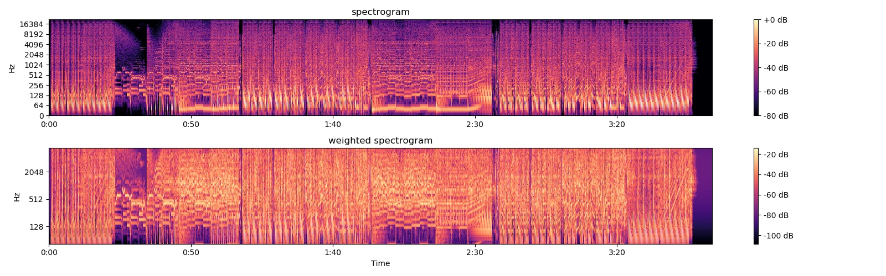
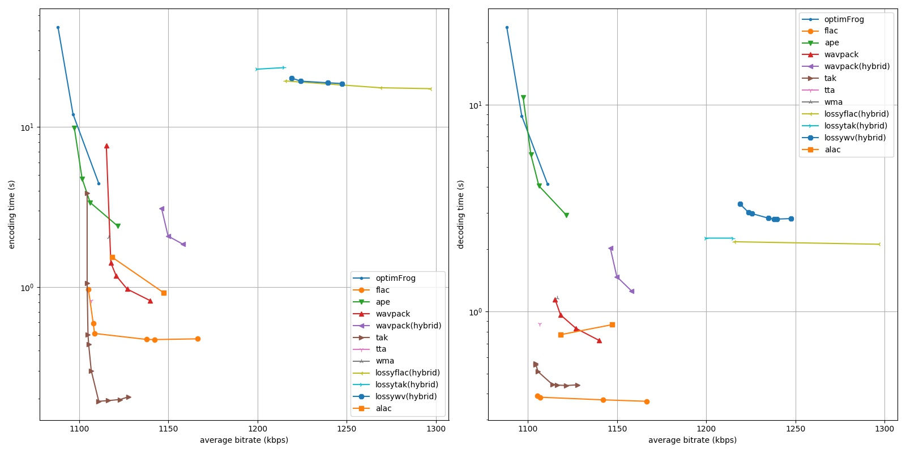
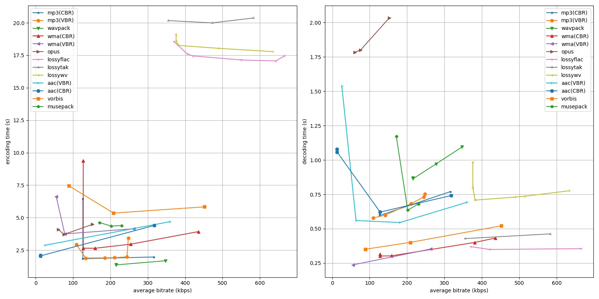
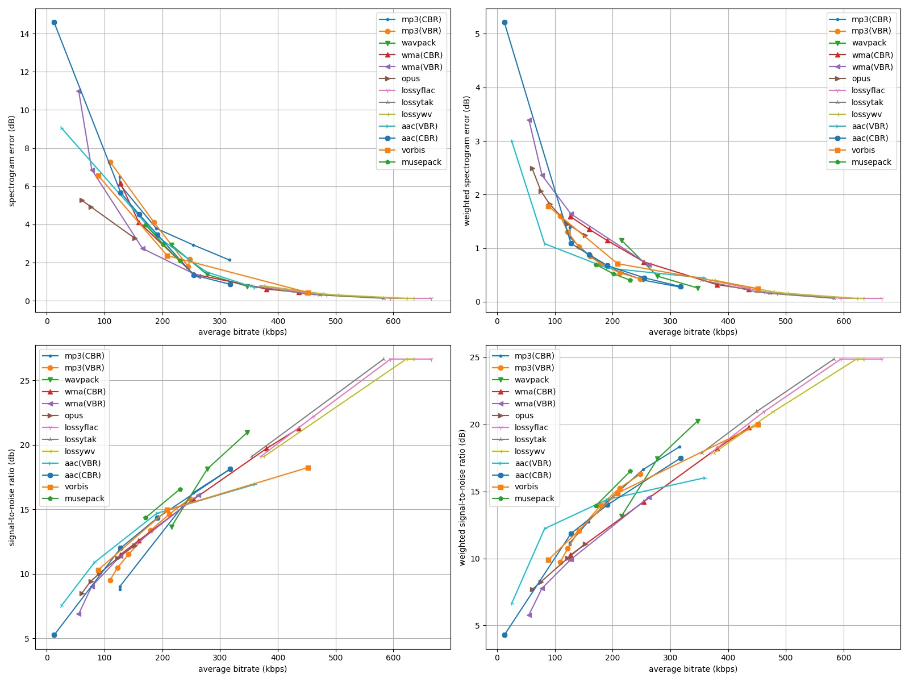
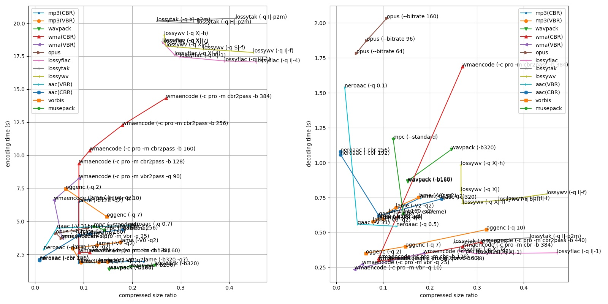

# Audio codecs comparsion

- FLAC (flac v1.3.2): Downloaded from https://xiph.org/flac/download.html
- MP3 (lame 3.100.1): Downloaded from https://www.rarewares.org/mp3-lame-bundle.php
- APE (mac 5.69): Downloaded from https://www.monkeysaudio.com/download.html
- Wavpack (wavpack 5.3.0): Downloaded from http://www.wavpack.com/downloads.html
- TAK (takc 2.3.0): Downloaded from http://thbeck.de/Tak/Tak.html
- TTA (tta 2.3): Downloaded from https://sourceforge.net/projects/tta/files/tta/ttaenc-win/
- WMA (WmaEncoder 0.2.9c): Downloaded from https://hydrogenaud.io/index.php/topic,90519.0.html
- lossyWAV (lossyWAV 1.4.2): Downloaded from https://wiki.hydrogenaud.io/index.php?title=LossyWAV
- ALAC (refalac v2.71): Downloaded from https://github.com/nu774/qaac/releases
- OptimFrog (ofc & ofs v5.100): Downloaded from http://losslessaudio.org/Downloads.php
- Opus (opusenc & opusdec 1.3): Downloaded from https://opus-codec.org/downloads/
- Ogg Vorbis (oggenc 2.88): Downloaded from https://www.rarewares.org/ogg-oggenc.php
- AAC
  - (qaac v2.71): Downloaded from https://github.com/nu774/qaac/releases, (follow [instructions here](https://hydrogenaud.io/index.php?topic=117089.0))
  - (NeroAac v1.5.1): Downloaded from http://wiki.hydrogenaud.io/index.php?title=Nero_AAC
- Musepack (mpcenc 1.30.0 & mpcdec 1.0.0): Downloaded from https://musepack.net/index.php?pg=win

For missing encoder or decoder, [`ffmpeg (4.3.1-2020-11-19 x64)`](https://www.gyan.dev/ffmpeg/builds/) is used. Also note that OptimFrog encoding and decoding always crashes for me, and the dual stream encoding cannot preserve lossless audio (due to the crash , I guess).

# Run your own benchmark
The script can run regardless of your OS, but the preset codecs parameters and included binaries are for Windows. You will need Python 3 and following libraries installed to run the benchmark.
- `numpy`
- `scipy`
- `librosa`
- `matplotlib`

In order to run the benchmark, you have to
1. Change the audio sources in the `test.py`
2. Collect missing dlls for `qaac` as mentioned above
3. Then execute `python test.py`

There are several things you can customize in test.py
- Change codecs parameters by change `lossless_codecs` and `lossy_codecs` dictionaries.
- Choose x86 or x64 version of the codecs by switch `x64` variable.
- Add your test audio files in `files` list.

# Results

## Criteria
- *Compression Ratio (CR)*: compressed file size / original uncompressed file size (lower the better)
- *Average Bitrate*: compression ratio times original bitrate
- *Spectrogram Error*: direct difference between power spectrograms (lower the better)
- *Weighted Spectrogram Error*: direct difference between A-weighted power spectrograms (lower the better)
- *Signal-to-Noise Ratio (SNR)*: noise is calculated from signal power difference (higher the better)
- *Weighted SNR*: noise is calculated from A-weighted signal power difference (higher the better)

When calculating the compressed file size for hybrid lossless audio codec (like `wavpack -c -b192`), the size of both compressed audio and correction file are counted in lossless charts, while only the size of compressed audio is counted in lossy charts.

> Note that not all results are shown in the plots since they will make the figure looks messy. Only best results in a series of codecs are plotted. For example in *encoding time - average bitrate* figure, only left-bottom data points are shown for an audio codec. For codec parameters in the figure, there's a *Full Charts* section below figures for each audio file. For complete results with numbers, please refer to [result.json](./result.json) or [result.md](./result.md)

## PLight - Bass_tek 2 (*Hardcore*)

- **Audio Spectrogram**

- **Lossless Codecs Performance Comparison**

- **Lossy Codecs Performance Comparison**

- **Lossy Codecs Quality Comparison**

 Full Charts 

- **Lossless Codecs Performance Comparison**

- **Lossy Codecs Performance Comparison**

- **Lossy Codecs Quality Comparison**

# References

- https://stsaz.github.io/fmedia/audio-formats/
- http://wiki.hydrogenaud.io/index.php?title=Lossy
- http://wiki.hydrogenaud.io/index.php?title=Lossless
- https://en.wikipedia.org/wiki/Comparison_of_audio_coding_formats
